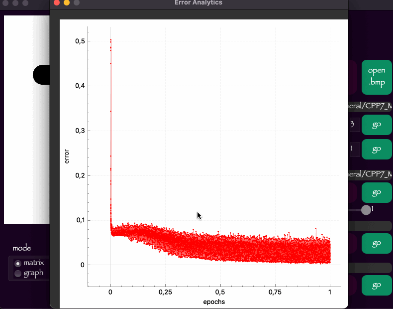

# Multilayer Perceptron

Implementation of a basic multilayer perceptron.

### Physiological background

A nerve cell of the brain, a neuron, is a quite complex structure. But without going into too much detail, a neuron consists of three main components: the body (soma) and the extensions (several dendrites and one axon). Dendrites are the branches through which the neuron receives signals from other neurons, and the axon is the only channel through which the neuron transmits impulses. Dendrites make up about 90% of all human nerve tissue, which tells us how much neuronal connectivity there is. Still, the signal transmission from neuron to neuron does not happen by itself. The thing is that each neuron has a certain voltage value and if it is exceeded, then the short-term "impulse" or "spike" happens and the signal is briefly transmitted through the axon. This value can be exceeded by passing the appropriate charge through the dendrites. Each neuron, however, has a different voltage value required to "spike". This way of the nerve tissue work allows us to translate the work with neurons into the theoretical field through the description of mathematical models and physical properties.

### Part 1. Implementation of a multilayer perceptron

- The program was developed in C++ language of C++17 standard.
- The program code is located in the src folder
- When writing code, I followed on Google-style
- Modules related to calculations are covered by unit tests using the GTest library.
- As a building system, Cmake was used (the program was written for MacOS), there is also a Makefile in the src folder, which contains the targets: all, install, uninstall, clear, dvi, dist, tests.
- Graphical interface implemented using the Qt library
- The program is implemented using the MVC pattern
- The program provides the ability to create and train neural network models for the classification of handwritten Latin letters
- The program is implemented separate window for draw handwritten Latin letters.
- Perceptron is implemented in *two* ways:
  - in matrix form (all layers are presented as weight matrices, this method was created using multi-thread)
  - in the form of a graph (each neuron is represented as a node-object connected to other nodes by links)
- Perceptron can have **2 to 5** hidden layers

- A sigmoid function is used to activate each hidden layer
- The Perceptron can be trained on an open dataset (for example, the letters EMNIST are in the "datasets" directory).
- Training is based on the backpropagation method
- Implemented the ability to upload images in BMP format with Latin letters and classify them
- You can run a real-time training process for a given number of epochs, displaying error control values for each training epoch. At the end of the training, a report is compiled in the form of a graph of the change in the average error for each case.

- It is also possible to run the training process using cross-validation for a given number of groups _k_. At the end of training, the graph will show the average error after each training epoch.

- The interface provides the ability to switch the number of layers and the number of neurons on the first hidden layer. In this case, the perceptron is completely recreated, that is, when creating the weights are filled with random values
- Implemented functions of import and export of perceptron weights
- You can test neural network in real-time on open datasets

### Part 2. Research

Based on the developed program, I compared the performance of two perceptron implementations: graph and matrix.
A 3-layer model was chosen with the number of neurons on the hidden layers 256-128-64 (experimentally revealed that the neural network gives better results when the number of neurons on the layers is a multiple of 2)
The weights used were the same, pretrained to 87.8446% It was the best accuracy which I could create.
You can glance the result of my tests about learning [here](misc/research/learn_result.md). 
Also I did a time experiment on a test sample 10/100/1000 times. Results of research you can find [here](misc/research/compare_methods.md)