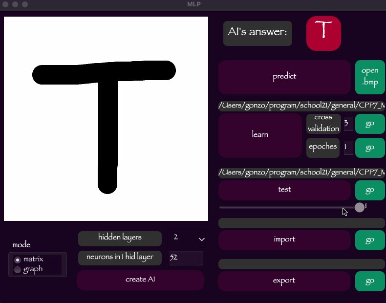

# Многослойный персептрон

Реализация базового многослойного персептрона.

### Физиологическая подоплека

Нервная клетка головного мозга, нейрон, представляет собой достаточно сложную структуру. Но не вдаваясь в подробности, нейрон состоит из трех основных компонентов: тела (сомы) и отростков (несколько дендритов и один аксон). Дендриты — это ветви, по которым нейрон получает сигналы от других нейронов, а аксон — единственный канал, по которому нейрон передает импульсы. Дендриты составляют около 90% всей нервной ткани человека, что говорит нам о том, насколько развита нейронная связь. Тем не менее, передача сигнала от нейрона к нейрону не происходит сама по себе. Дело в том, что каждый нейрон имеет определенное значение напряжения и при его превышении происходит кратковременный «импульс» или «спайк» и кратковременно передается сигнал по аксону. Это значение может быть превышено путем пропускания соответствующего заряда через дендриты. Однако каждый нейрон имеет разное значение напряжения, необходимое для «всплеска». Такой способ работы с нервной тканью позволяет перевести работу с нейронами в теоретическую плоскость через описание математических моделей и физических свойств.

### Часть 1. Реализация многослойного персептрона

- Программа разработана на языке C++ стандарта C++17.
- Код программы находится в папке src
- При написании кода я следовал Google-style
- Модули, связанные с вычислениями, покрыты модульными тестами с использованием библиотеки GTest.
- В качестве системы сборки использовался CMake (программа писалась для MacOS), так же в папке src есть Makefile, в котором лежат цели: all, install, uninstall, clear, dvi, dist, tests.
- Графический интерфейс реализован с использованием библиотеки Qt
- Программа реализована с использованием паттерна MVC
- В программе предусмотрена возможность создания и обучения нейросетевых моделей для классификации рукописных латинских букв
- В программе реализовано отдельное окно для рисования рукописных латинских букв.
- Персептрон реализован *двумя* способами:
  - в матричной форме (все слои представлены в виде весовых матриц, этот метод создан с использованием многопоточности)
  - в виде графа (каждый нейрон представлен как узел-объект, связанный с другими узлами связями)
- Персептрон может иметь от **2 до 5** скрытых слоев.
  
- Для активации каждого скрытого слоя используется сигмовидная функция.
- Персептрон можно обучать на открытом наборе данных (например, буквы EMNIST находятся в каталоге "наборы данных").
- Обучение основано на методе обратного распространения
- Реализована возможность загружать изображения в формате BMP с латинскими буквами и классифицировать их
- Вы можете запустить процесс обучения в реальном времени для заданного количества эпох, отображая значения контроля ошибок для каждой эпохи обучения. По окончании обучения составляется отчет в виде графика изменения средней ошибки для каждого случая.
  
- Также возможен запуск процесса обучения с использованием кросс-валидации для заданного количества групп _k_. В конце обучения на графике будет показана средняя ошибка после каждой эпохи обучения.
  
- В интерфейсе предусмотрена возможность переключения количества слоев и количества нейронов на первом скрытом слое. При этом персептрон полностью пересоздается, то есть при создании веса заполняются случайными значениями.
- Реализованы функции импорта и экспорта весов персептрона
- Вы можете протестировать нейронную сеть в режиме реального времени на открытых наборах данных.
  

### Часть 2. Исследование

На основе разработанной программы я сравнил производительность двух реализаций персептрона: графовой и матричной.
Выбрана 3-х слойная модель с количеством нейронов на скрытых слоях 256-128-64 (экспериментально выявлено, что лучшие результаты нейронная сеть дает при количестве нейронов на слоях кратном 2)
Используемые веса были одинаковыми, предварительно обученными до 87,8446%. Это была лучшая точность, которую я мог создать.
Вы можете посмотреть результаты моих тестов по обучению [здесь](misc/research/learn_result.md). 
Также я провел временной эксперимент на тестовом образце 10/100/1000 раз. Результаты исследования вы можете найти [здесь](misc/research/compare_methods.md)